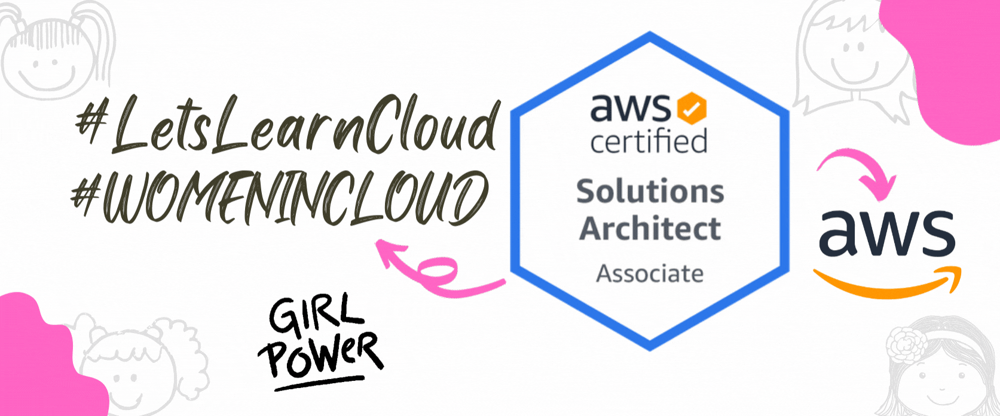

 <h1 align="center">Hi, I'm Robina </h1>

   &nbsp;&nbsp;
&nbsp;&nbsp;
 &nbsp;&nbsp;
 

### - About Me
I'm Robina from Pakistan, I'm a Freelancer , Cloud Architect, AWS Techical Trainer and Microsoft Certified Trainer. I really enjoy learning Cloud Technologies .I worked on Wordpress too.

### - Skills and Experience
. Amazon Cloud / Google / Microsoft Azure

- 🔭 I’m currently working on SheCloud 
- 🌱 I’m currently learning Kubernetess 
- 💬 Ask me about Amazon Web Service , Microsoft Azure and Google Cloud

### - Languages and Tools...

  
      
  
  
   
    

### - Cloud Platforms : 

## 📬 - Get in touch

        
 

